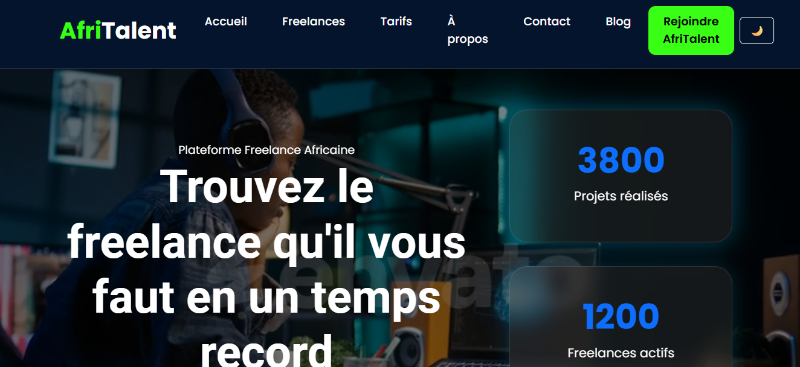

# AfriTalent 
Projet fil rouge — Plateforme de mise en relation entre freelances africains et 
clients. 
Auteur : Fatou Gaye
Promotion : L1 Web — ISI
# AfriTalent

## Présentation du projet

AfriTalent est une plateforme web qui met en relation les entreprises et les freelances africains spécialisés dans les métiers du numérique.

### Fonctionnalités

- Recherche de freelances
- Filtrage par catégorie
- Affichage des profils détaillés
- Formulaire de contact avec validation JavaScript
- Mode sombre / mode clair
- Compteurs animés
- Animations au scroll
- Design responsive

---

## Technologies utilisées

- HTML5
- CSS3
- JavaScript
- Bootstrap 5

---

## Structure du projet

```text
AfriTalent/
│
├── index.html
├── freelances.html
├── tarifs.html
├── about.html
├── contact.html
│
├── css/
│   └── style.css
│
├── js/
│   └── main.js
│
├── icones/
├── videos/
│
└── README.md
```

---

## Pages du site

### Accueil
Présentation de la plateforme avec statistiques animées et témoignages.

### Freelances
Consultation et filtrage des freelances par catégorie.

### Tarifs
Présentation des différentes offres proposées.

### À propos
Historique, mission et valeurs de la plateforme.

### Contact
Formulaire de contact avec validation JavaScript.

---

## Capture d'écran



---

## Déploiement

Site accessible en ligne :

```text
 https://fatougaye18.github.io/gaye-fatou-AfriTalent/
```

---
## Auteur

**Fatou Gaye**

Projet réalisé dans le cadre de la formation en Développement Web.